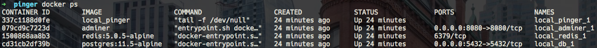
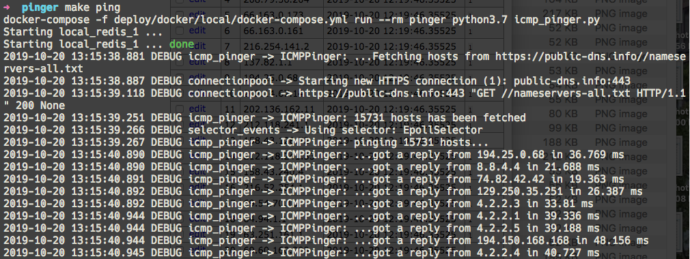
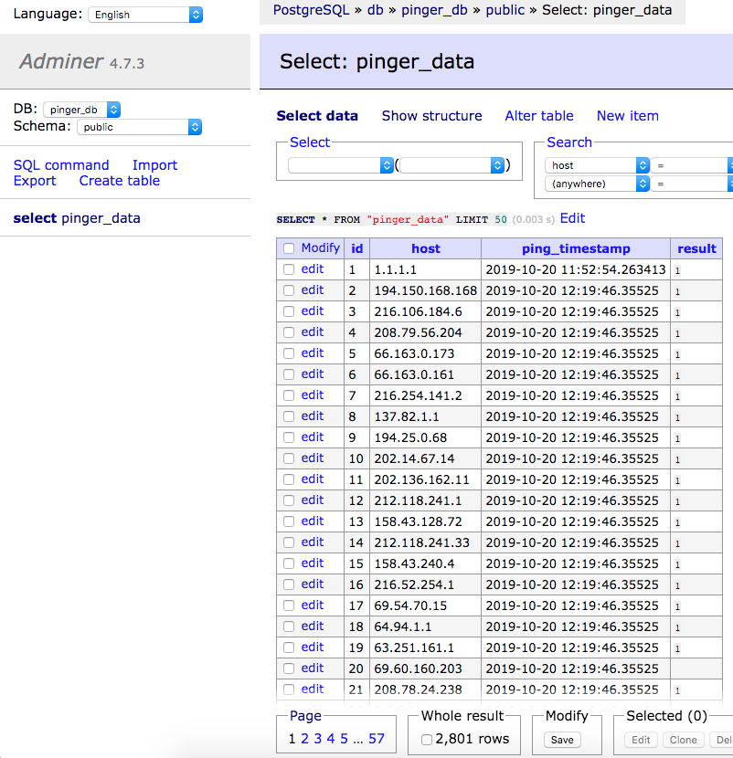
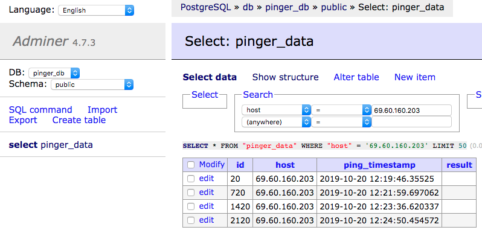
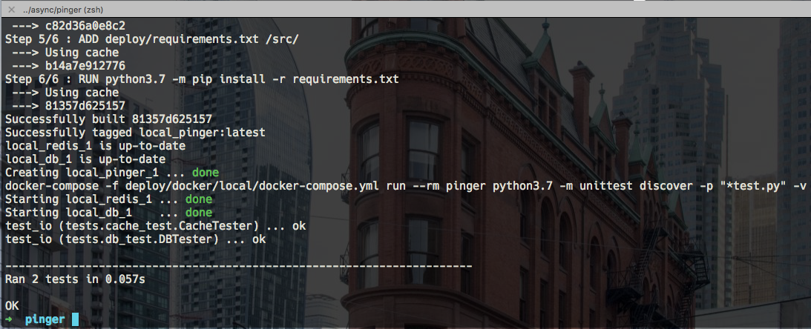

Pinger is a python service that pings numerous hosts asynchronously (via ICMP protocol) and saves the results to Redis cache and Postgres database.
The cache is needed to get swift access to the most recent ping results and the database is necessary to assess hosts' downtime statistics.
Adminer is added as a neat GUI to Postgres.

What is ping and ICMP (from [Wikipedia](https://en.m.wikipedia.org/wiki/Ping_(networking_utility))):
> Ping operates by sending Internet Control Message Protocol (ICMP) echo request packets to the target host and waiting for an ICMP echo reply. 

# How it works
1. A list of hosts is fetched. For testing purposes publicly available hosts are used. If the list if not available, a local copy is used.
The local copy (`hosts` file) contains approximately 15k+ hosts.
2. Asynchronous calls are made - `icmp_pinger.py`
3. Results are stored in Redis - `connectors/cache.py`
4. Results are stored in Postgres - `connectors/db.py`

The main script `icmp_pinger.py` should be added to cron or some `.py` invoker to run continuously.

One should create `.env` file with the following environment variables before running make commands:
```
POSTGRES_USER=pinger
POSTGRES_PASSWORD=pass
POSTGRES_HOST=db
POSTGRES_DB=pinger_db

REDIS_PORT=6379
REDIS_HOST=redis

ADMINER_PORT=8080
```

# How to run pinger
1. `make rebuild_and_run`
2. `make ping`

# API
The service is dockerized so one can easily run it or access any parts of it via docker or docker-compose.



The main commands are:
- `make rebuild_and_run`: rebuilds the service and runs `pinger` container. It does not run async ping command, just creates an infrastructure for it.
- `make test`: tests cache and database.
- `make run`: restarts the service and runs `pinger` container. It does not rebuild the service.
- `make ping`: pings hosts and saves the results; hosts are fetched from [here](https://public-dns.info//nameservers-all.txt) or `hosts` file if the URL is not accessible.
By default, only 1000 hosts are pinged (the value can be changed in `settings.py`).



One can use Redis CLI interface to test Redis storage. For example, after `make ping`
one can check if the results were saved successfully by doing:
```
docker exec -it local_redis_1 redis-cli get '95.215.40.135'
```

Data stored in Postgres can be accessed directly from the related container or via GUI interface at [http://localhost:8080](http://localhost:8080).
`result` column for hosts which were reached contains `1`, it is empty otherwise.

One can check all the data:



Or check statistics for a single host:



# Tests
Tests are made to be sure that Postgres and Redis are up and running are reachable by `pinger`.


